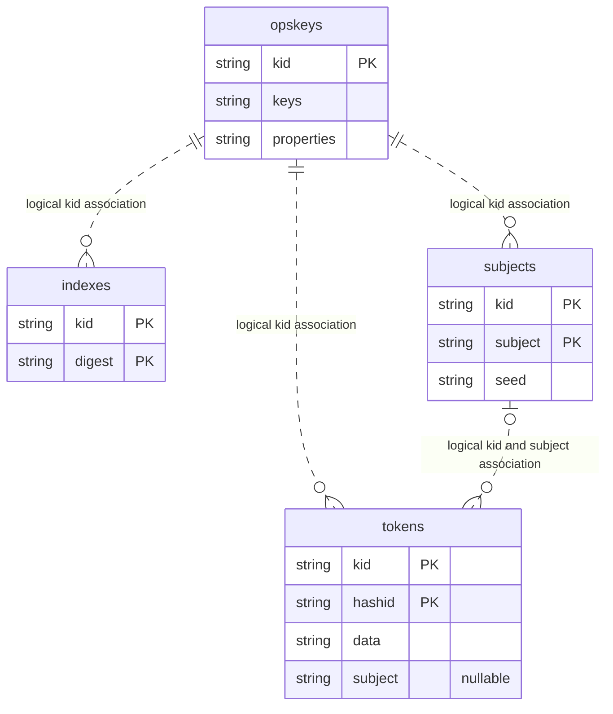

# Database Model and Cryptographic Storage

This document describes the current Vectis database model, what is persisted,
how each column is protected, and the operational requirements for recovery.
SQLite and PostgreSQL use the same logical model. SQL schemas and application
validation are the source of truth; this document does not introduce migrations.

See [Cryptographic Flows and Key Derivation](Cryptography.md) for init/unseal,
parent/subject key derivations and capability-specific cryptographic flows.

## Entity-Relationship Model



**All relationships shown are logical application relationships, not declared
foreign keys.** The SQL schemas declare primary keys, but no foreign keys or
automatic cascading deletes. The dotted edges distinguish associations from
the identifying primary-key definitions; they do not imply SQL enforcement.

Multiple `PK` annotations describe a **composite** primary key, not independent
uniqueness for each column. Tokens without a subject have `subject IS NULL`.
Subject-scoped tokens reference the pair `(kid, subject)`, not the subject ID
alone. Direct SQL changes can violate relationships that API operations enforce.

## Table Responsibilities

| Table | Function | Primary key | Stored information |
| --- | --- | --- | --- |
| `opskeys` | Durable operational keys and their properties | `kid` | Encrypted key material and encrypted metadata, including lifecycle |
| `tokens` | Recoverable tokenization and one-time token consumption | `(kid, hashid)` | Keyed token lookup digest, encrypted payload, optional subject association |
| `indexes` | Persisted blind-index membership | `(kid, digest)` | Deterministic keyed digests, not the indexed plaintext |
| `subjects` | Shared, independently generated per-subject seeds | `(kid, subject)` | Deterministic subject identifier and authenticated encrypted seed |

The public token itself is random, not encrypted plaintext. It is returned to
the client; the database stores its lookup HMAC rather than the token string.
Client request `ref` values are not separate storage columns.

## Columns and Algorithms

### `opskeys`

| Column | Meaning | Protection / algorithm | Key origin and representation |
| --- | --- | --- | --- |
| `kid` | Operational key identifier | BLAKE2b-256 hash; no additional encryption | Hash of the Base64 ciphertext component of the stored keys envelope, represented as 64 hex characters |
| `keys` | Serialized operational key material, including private and symmetric keys | Fixed AES-256-GCM authenticated encryption | Internal `db_key`, derived from the initialization root key using HKDF-BLAKE2b-256; Base64 envelope |
| `properties` | Operational metadata and lifecycle | Fixed AES-256-GCM authenticated encryption | Independent internal `properties_key`, derived from the same root with a different purpose; Base64 envelope |

The wrapping algorithm is fixed by `INTERNAL_KEYS_CIPHER`; it is not selected by
the operational KID. The KID's own cipher protects capability data, not the
database row containing that key. The application checks the binding between
KID, key payload and properties when loading them.

### `tokens`

| Column | Meaning | Protection / algorithm | Key origin and representation |
| --- | --- | --- | --- |
| `kid` | Operational key association | No additional encryption | Visible KID, 64 hex characters |
| `hashid` | Lookup identifier for a token | HMAC-BLAKE2b-256 over profile/token context, additionally subject/version for stored mode | Profile hash key, or subject-derived hash key; 64 hex characters |
| `data` | Token payload, including plaintext and metadata | AEAD cipher of the operational KID | Profile data key, or subject-derived data key; Base64 envelope |
| `subject` | Optional subject association | No additional encryption | Subject ID in hex; nullable for legacy tokens |

The payload is not encrypted directly with the raw operational key. Signed
tokenization profiles derive separate hash and data keys. Stored-subject profiles
derive child keys using the authenticated seed and distinct token purposes.
The profile determines `one_time`; there is no separate SQL consumption flag.

### `indexes`

| Column | Meaning | Protection / algorithm | Key origin and representation |
| --- | --- | --- | --- |
| `kid` | Operational key association | No additional encryption | Visible KID |
| `digest` | Blind-index value used for membership verification | MAC resolved from the KID's hash algorithm; no additional encryption | Purpose-derived MAC key bound to the profile; hexadecimal digest |

Blind indexes reuse MAC profiles, which define name, KID and context, not an
algorithm selector. Vectis reads the referenced KID's hash algorithm and resolves
SHA-3(224/256/384/512) to KMAC-224/256/384/512; other supported hash variants
resolve `HMAC(<hash>)`.
The digest is deterministic for the same key, profile context and plaintext.
The table does not store the plaintext, client `ref`, or profile name as columns.

### `subjects`

| Column | Meaning | Protection / algorithm | Key origin and representation |
| --- | --- | --- | --- |
| `kid` | Operational key association | No additional encryption | Visible KID |
| `subject` | Identifier bound to KID, creator profile and exact subject name | HMAC-BLAKE2b-256 over the `subject-lookup` context | Creator tokenization profile's hash key; 64 lowercase hex characters |
| `seed` | Independently generated 32-byte seed in a versioned payload | AEAD cipher of the creator's operational KID | Wrapping key derived from the creator profile's data key using HKDF-BLAKE2b-256; Base64 envelope |

The subject name is not stored as a plaintext column. The seed envelope binds
KID, creator profile, subject and cipher in its AAD. Its profile name is only a
lookup hint: opening requires a compatible original `stored` tokenization
profile from the signed snapshot and authentication of the complete envelope.

A single seed can serve tokens, FPE and symmetric under the same KID. Each
capability derives independent keys with different purposes. FPE and symmetric
do not add ciphertext rows to this table.

## Key Hierarchy and Envelopes

- The initialization root derives independent internal keys. `opskeys.keys`
  uses info `vectis/db-key/v1`; properties uses `vectis/properties-key/v1`.
  Both use the existing HKDF-BLAKE2b-256 and internal root salt.
- Operational keys supply the parents for tokenization, MAC/index, and other
  capabilities. Supported operational AEAD variants are `AES-128/GCM`,
  `AES-192/GCM`, `AES-256/GCM` and `ChaCha20Poly1305`.
- Subject seed wrapping uses the creator profile's data key with a dedicated
  wrapping derivation. Child capability derivations use the opened seed as salt;
  they never reuse another capability's derived key.
- FPE remains FF1 with AES-256, regardless of the KID's AEAD variant. Symmetric
  uses the KID's AEAD variant. Neither stores its output ciphertext in Vectis.

The four encrypted storage columns (`keys`, `properties`, `data`, `seed`) use:

```text
Base64(ciphertext including AEAD tag).Base64(nonce).Base64(AAD)
```

Base64 is an encoding, **not encryption**. Nonce and AAD are readable; AAD is
authenticated, not confidential. It can expose profile names, KIDs and other
context metadata. Algorithms and policy come from trusted runtime/signed
configuration, not arbitrary fields in a stored envelope. Corrupt envelopes
must not produce plaintext or fallback to another key.

## State and Transaction Contracts

| Operation | Storage behavior |
| --- | --- |
| Token encode single/batch | Persist encrypted payloads; batch inserts are transactional |
| Reusable token decode | Read/decrypt; does not delete the row |
| One-time token decode | Validate/decrypt, then commit consumption before reporting success; competing consumers cannot both consume the same row |
| One-time decode batch | Consumption is transactional; a failed batch must not consume only a subset |
| Token delete | Explicit row deletion; absent, deleted or consumed token returns `404` |
| Index create | Persist deterministic digest; identical `(kid, digest)` does not create another row |
| Subject create | Insert without overwriting an existing seed; `201` for creation, `200` for idempotent reuse |
| Subject delete | Delete associated tokens and seed in one transaction; `204` after success, `404` when subject is absent |

Subject-aware token writes check that the seed generation they used still exists
and matches before inserting. A delete/recreate must not allow a stale encode to
persist under the new generation. The application implements this coordination;
there is no SQL foreign key cascade to rely on.

Lifecycle is part of encrypted key properties, not a SQL status column. API
operations enforce their own lifecycle and authorization policies; direct SQL
access bypasses those policies. Logical `destroyed` status is not a statement
that all database copies or backups have been physically erased.

Deleting a shared subject prevents future seed openings for tokens, FPE and
symmetric, but cannot erase ciphertexts held by clients or cancel requests that
already opened the seed. Recreating the ID generates a new seed, not the old
keys. Authenticated ciphertexts from the old generation fail authentication;
unauthenticated FPE does not promise detection of incorrect recovery.

## Schemas, Limits and Operations

| Backend | Schema | Deployment notes |
| --- | --- | --- |
| SQLite | [sqlite_schema.sql](../src/db/sqlite_schema.sql) | Local default; payloads use declared `VARCHAR(10240)`, but SQLite does not enforce that length |
| PostgreSQL | [postgres_schema.sql](../src/db/postgres_schema.sql) | Shared durable backend; encrypted payload columns use `TEXT` |

Both schemas retain `VARCHAR(128)` declarations for identifiers/digests where
shown. Application validators impose the actual identifier, digest and envelope
limits. Do not infer cryptographic output sizes from the SQL column declarations.

Current application limits include 32,768 characters for key/properties
envelopes and 131,072 for token envelopes. Token decode batch additionally limits
accumulated stored envelopes to 5 MiB, counting repeated tokens. This is not a
global response-size limit or exact process-memory bound. See [Limits](Limits.md)
for seed, digest, plaintext, batch and transport limits.

Vectis validates the schema when connecting. It does not create tables or apply
migrations at startup. Operators must:

1. Provision the database and apply the appropriate schema for a new installation.
2. For an older installation without subjects, apply the backend-specific
   [subject migration](../src/db/migrations) once before upgrading nodes. Do not
   reapply it to an installation already using the current schema.
3. Keep runtime credentials separate from schema-administration credentials.
   Grant the operations required by storage, including the documented
   PostgreSQL `UPDATE(seed)` privilege used by subject row locking.
4. Treat manual SQL deletion, schema changes and cleanup as administrative
   operations, not substitutes for the API's transactional contracts.

For PostgreSQL setup, see [the tutorials](tutorials/README.md). Connection
settings are documented in [ENV](ENV.md). Multi-node runtime snapshots are
described in [Clustering](Clustering.md).

## Backups, Recovery and Privacy

A database backup alone is not a complete recovery set. Recovery also depends
on compatible initialization/root material and its unseal material, the signed
configuration, operational keys, and the original creator profiles needed to
open subject seeds. Keep database and key/config generations consistent; verify
restoration in an isolated environment. See [HA and DR](HA_DR.md) for procedures.

Encryption of fields is not full database encryption. A database reader can
observe KIDs, subject associations, row counts, encrypted lengths, readable AAD,
and repeated index digests. Deterministic indexes reveal equality within their
keyed context. Missing foreign keys also mean orphan rows can exist after direct
SQL edits or historical behavior; Vectis does not automatically purge historical
orphans on startup.

Restoring a backup can restore a deleted subject seed or a consumed/deleted
token. Logical deletion does not erase WAL files, replicas, old snapshots or
external ciphertexts. Apply operational backup-retention and access controls;
do not claim deletion guarantees across retained recovery copies.

## What Is Not Stored Here

- Raw returned token strings or subject names as separate columns.
- Plaintexts, token payload metadata, private keys or subject seeds in cleartext
  columns; they are inside authenticated encrypted payloads where applicable.
- FPE/symmetric output ciphertexts, stateless MAC results, commitment openings
  and secret-sharing outputs as capability rows in these four tables.
- Signed configuration, API credential configuration, initialization files,
  unseal files or audit logs as separate entities in this database schema.

## Implementation References

- [Storage abstraction and validation](../src/core/storage/mod.rs),
  [SQLite implementation](../src/core/storage/sqlite.rs),
  [PostgreSQL implementation](../src/core/storage/postgres.rs).
- [Internal derived keys](../src/ops/internal_keys.rs),
  [operational key persistence](../src/ops/keys.rs).
- [Tokenization](../src/core/tokenization.rs),
  [subject envelopes](../src/core/subjects.rs), [MAC profiles](../src/core/mac.rs),
  [blind-index operations](../src/ops/indexes.rs).
- [API contracts](API.md), [architecture reference](Reference.md).
