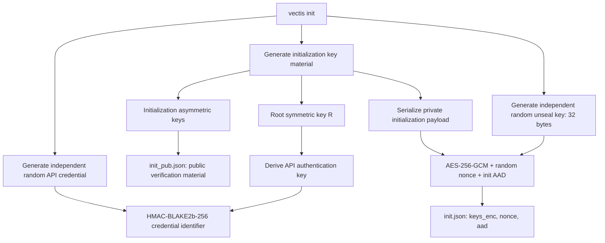
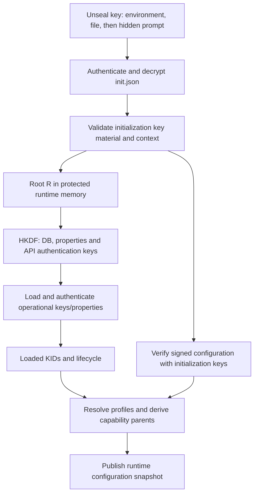
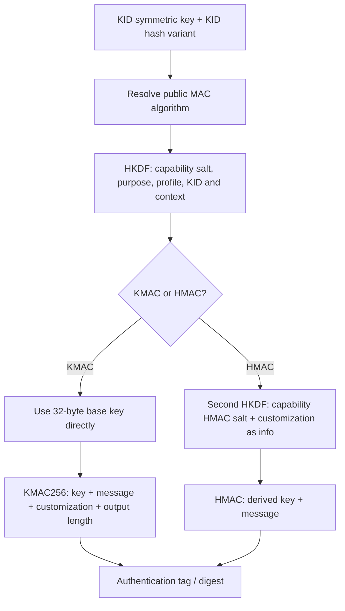
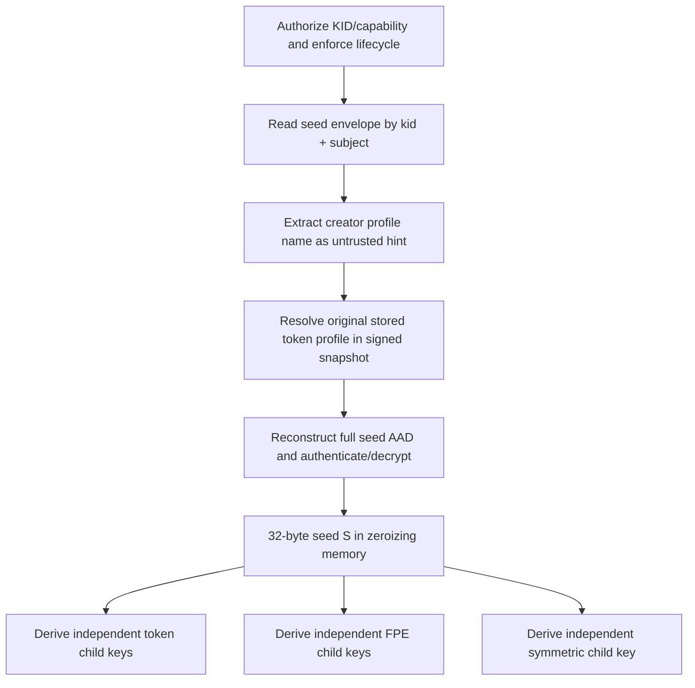

# Cryptographic Flows and Key Derivation

This document explains the current Vectis bootstrap, key hierarchy, HKDF inputs,
and capability flows. It describes the implementation, not a new cryptographic
protocol. See [BD](BD.md) for persistence, [API](API.md) for wire contracts, and
[Internal](Internal.md) for implementation coordination.

## Reading the Diagrams

| Term | Meaning |
| --- | --- |
| IKM | Input key material: the secret parent supplied to HKDF |
| Salt | HKDF salt; a fixed domain value or an authenticated subject seed, depending on the derivation |
| Info | Exact purpose/context bytes used to separate derived keys |
| Root `R` | Symmetric key inside the authenticated initialization payload |
| `K_kid` | Symmetric operational key of the selected KID, decoded from hex |
| Seed `S` | Independently generated 32-byte subject secret after authenticated opening |
| `L_cipher` | Key length required by the KID's symmetric cipher |

All application calls to `create_hkdf` use **HKDF(BLAKE2b(256))**. Output lengths
are bytes. Hex and Base64 represent bytes; they do not encrypt them. Examples
below show exact field order, with placeholders substituted by validated values.
Info contexts built with `build_validated_aad` are single-line `key=value`
strings joined by semicolons, without a trailing semicolon or newline.

**HKDF info is not AEAD AAD.** Info determines a key; AAD authenticates context
of a particular encrypted object. Some flows deliberately use AAD bytes as
part of info, but these are still different roles.

## Initialization and Unseal



`init` generates key material with the existing cryptographic RNG and key
generation routines. It does **not** derive all asymmetric keys from a single
HKDF output. The unseal key and API credential are also independently random.

The unseal key encrypts the private initialization payload with fixed
AES-256-GCM. The root `R` is **inside that payload**, not equal to the unseal
key. `init.json` uses hex ciphertext/nonce and readable AAD; it is not the
three-component Base64 database envelope. Public initialization material does
not contain the symmetric root or private keys.

The CLI writes initialization artifacts and reports the bootstrap credentials.
Those credentials are secrets: do not put init output in logs or source control.
It refuses to overwrite existing initialization files.

### Opening and Preparing the Runtime



Unseal lookup checks `VECTIS_UNSEAL_KEY`, then the configured/default unseal
file, then the hidden prompt. Invalid explicit material fails validation; it
does not silently become another key. Successful startup authenticates and
validates private initialization material before using it.

The HTTP startup path derives internal keys, loads the operational keystore,
then verifies/validates configuration and prepares profiles against those keys.
The diagram shows dependencies, not all startup subsystems. Configuration
signatures use initialization signing keys; they are not an HKDF output or a
MAC made with the API authentication key.

### Root-Derived Internal Keys

All rows below use IKM `R`, salt `vectis/internal-keys/v1` and output 32 bytes.

| Key | Exact info | Use |
| --- | --- | --- |
| DB key | `vectis/db-key/v1` | AES-256-GCM wrapping of operational key payloads |
| Properties key | `vectis/properties-key/v1` | Separate AES-256-GCM wrapping of operational properties |
| API authentication key | `vectis/api-key-auth/v1` | HMAC-BLAKE2b-256 over the API credential's textual bytes |
| SLH-DSA private-file key | `vectis/slh-dsa-file-key/v1` | AES-256-GCM protection of generated SLH-DSA private-key artifacts |

The SLH-DSA file key is derived when that local artifact operation needs it;
it is not an operational KID key. SLH-DSA signing keys themselves are generated,
not produced by this HKDF. The API credential is likewise random: its server
identifier is a keyed HMAC, not the credential or root key.

## Operational KIDs and Profile Parents

Operational key creation generates independent key material according to its
resolved crypto profile. The symmetric key and asymmetric private keys are
wrapped under the internal DB key; properties use the separate properties key.
The KID is a BLAKE2b-256 identifier of the Base64 ciphertext component, not an
HKDF output. Loading checks KID/payload/properties bindings and key validity.

Operational capability parents derive from `K_kid`, **not** from the unseal
key. The supported operational AEAD variants have these key lengths:

| Cipher | `L_cipher` |
| --- | --- |
| `AES-128/GCM` | 16 bytes |
| `AES-192/GCM` | 24 bytes |
| `AES-256/GCM` | 32 bytes |
| `ChaCha20Poly1305` | 32 bytes |

Nonce sizes follow the existing `SymmetricCipherSpec`; do not infer them from
the key length. FPE always prepares FF1 with AES-256 and a 32-byte key,
independently of the operational KID's AEAD variant.

### Tokenization Parents

| Output | IKM | Salt | Exact info | Bytes |
| --- | --- | --- | --- | --- |
| Profile hash key | `K_kid` | `vectis/tokenization/v1` | `purpose=token-hash;profile=<profile>;kid=<kid>;tokenization_version=token-random-v1` | 32 |
| Profile data key | `K_kid` | `vectis/tokenization/v1` | `purpose=token-data;profile=<profile>;kid=<kid>;tokenization_version=token-random-v1` | `L_cipher` |

```text
KID symmetric key
    +-- HKDF(token-hash) -> HMAC lookup key
    +-- HKDF(token-data) -> AEAD payload key

Encode: random token -> lookup HMAC -> encrypt plaintext/metadata -> persist
Decode: lookup HMAC -> read envelope -> authenticate/decrypt -> return plaintext
One-time decode: report success only after transactional consumption commits
```

The token is a random opaque value, not ciphertext of the plaintext. The stored
lookup uses HMAC-BLAKE2b-256. Payload encryption uses the KID's AEAD cipher with
the derived data key. Legacy lookup authenticates profile/token context;
stored-subject lookup additionally binds subject and version. See the API for
the complete token payload AAD and single/batch contracts.

### FPE Parents and Authentication

| Output | IKM | Salt | Exact info | Bytes |
| --- | --- | --- | --- | --- |
| Parent FF1 key | `K_kid` | `vectis:fpe:ff1:v1` | `profile=<profile>;kid=<kid>;fpe_version=<version>` | 32 |
| Parent FPE MAC key | `K_kid` | `vectis:fpe:mac:v1` | `purpose=fpe-auth;profile=<profile>;kid=<kid>;fpe_version=<version>;auth_version=v1` | 32 |

The MAC parent exists only for `authenticated: true`. Legacy FF1 derivation
does not gain a new purpose field: its original info must stay unchanged.

```text
Signed profile -> resolve alphabet and preserved characters
Input -> check total length and effective variable-symbol domain
      -> extract variable symbols -> one FF1 transformation
      -> reconstruct preserved characters in their original positions

Authenticated encrypt -> HMAC-BLAKE2b-256 -> separate lowercase hex tag
Authenticated decrypt -> verify tag -> only then execute FF1
```

The MAC input is `canonical_json_v1` over purpose, authentication version, KID,
profile name/version, resolved alphabet, preserved-character string, tweak and
complete ciphertext. It does not include `ref` or subject. Subject separation
comes from the key, as described below. Batch authenticates all tags before
decrypting any item. Unauthenticated FF1 provides no integrity guarantee.

### MAC, Blind Indexes, Commitments and Sharing

The signed profile selects its KID and context, **not** a MAC algorithm. The
KID's hash variant resolves SHA-3(224/256/384/512) to the corresponding
KMAC-224/256/384/512; other supported hashes resolve `HMAC(<hash>)`.

For these derivations, `<context-fields>` means each signed context label is
appended in its configured order with a `context.` prefix. For example,
`tenant=acme;version=1` contributes `context.tenant=acme;context.version=1`.
The resolved public algorithm string is substituted into `<algorithm>`.

| Base output | IKM | Salt | Exact info | Bytes |
| --- | --- | --- | --- | --- |
| MAC/index base key | `K_kid` | `vectis/mac/v1` | `purpose=mac-key;profile=<profile>;kid=<kid>;algorithm=<algorithm>;<context-fields>` | 32 |
| Commitment base key | `K_kid` | `vectis/commitment/v1` | `purpose=commitment-key;profile=<profile>;kid=<kid>;algorithm=<algorithm>;<context-fields>` | 32 |
| Share authentication base key | `K_kid` | `vectis/sharing/v1` | `purpose=sharing-key;profile=<profile>;kid=<kid>;algorithm=<algorithm>;<context-fields>` | 32 |

All three use a customization string:

```text
profile=<profile>;kid=<kid>;<context-fields>
```

KMAC keeps the base key and passes this customization into KMAC. HMAC applies
a **second HKDF** with the base key as IKM, customization as info, 32-byte
output, and a purpose-specific salt:

| HMAC capability | Second HKDF salt |
| --- | --- |
| MAC / blind index | `vectis/mac/hmac/v1` |
| Commitments | `vectis/commitment/hmac/v1` |
| Secret sharing authentication | `vectis/sharing/hmac/v1` |

```text
MAC: profile context + plaintext -> keyed tag
Index: same MAC mechanism -> deterministic digest -> persist/check membership
Commitment: random opening + plaintext + context -> canonical payload -> keyed tag
Sharing: random Shamir coefficients -> shares -> authenticate each share envelope
```

An opening is random, not an HKDF-derived encryption key. Secret sharing uses
Shamir split/interpolation; its HKDF key authenticates envelopes, not the
polynomial or reconstructed secret. Neither commitments nor sharing are
ordinary AEAD encryption of the input. Their outputs are returned to clients;
blind-index digests, unlike those outputs, are persisted.

### KMAC: Authentication, Not Encryption

**KMAC (Keccak Message Authentication Code)** is a keyed authentication
function built from cSHAKE/Keccak. It takes a secret key, message, requested
output length and customization string, and produces a tag. It does not encrypt
or hide the input, and is not the HKDF used to derive Vectis capability keys.
See [NIST SP 800-185](https://csrc.nist.gov/pubs/sp/800/185/final).

In Vectis, MAC/blind indexes, commitments and share-envelope authentication
use KMAC when their KID's hash variant is SHA-3. Their profile identifies the
KID and signed context, not an independently selectable MAC algorithm.



The customization string is the signed `profile`, `kid` and prefixed context
labels documented above. It supplies domain separation to KMAC directly.
Botan receives it through `set_nonce(customization)`; despite that API name,
this is **not a random AEAD nonce**, not a secret, and not a separate HKDF salt.
KMAC still uses the first HKDF-derived base key; only the second HMAC-specific
derivation is skipped.

NIST defines **KMAC128 and KMAC256**. Vectis uses the KMAC256 primitive for all
of the following public labels; their suffixes denote **tag length in bits**,
not four different standard primitives or four security-strength claims:

| KID hash variant | Vectis public label | Botan algorithm | Tag bytes |
| --- | --- | --- | --- |
| `SHA-3(224)` | `KMAC-224` | `KMAC-256(224)` | 28 |
| `SHA-3(256)` | `KMAC-256` | `KMAC-256(256)` | 32 |
| `SHA-3(384)` | `KMAC-384` | `KMAC-256(384)` | 48 |
| `SHA-3(512)` | `KMAC-512` | `KMAC-256(512)` | 64 |

Verification recomputes the expected keyed tag and uses the capability's
comparison/validation path. A plain hash is not a substitute: it lacks the
secret authentication key. Deterministic blind-index tags still reveal equality
within their keyed context; authentication does not make them encrypted data.

This KMAC selection does **not** change token lookup, subject identity, API
credential authentication or FPE authentication, which retain their explicitly
defined HMAC-BLAKE2b-256 mechanisms. Local symmetric authentication comes from
AEAD, not KMAC.

## Shared Subject Seeds

Subject identity is HMAC-BLAKE2b-256 with the creator tokenization profile's hash
key over this exact context:

```text
purpose=subject-lookup;kid=<kid>;profile=<creator>;subject_name=<name>;version=v1
```

Subject creation generates `S` randomly. A dedicated wrapping key encrypts the
seed payload using the creator profile's AEAD variant:

| Output | IKM | Salt | Exact info | Bytes |
| --- | --- | --- | --- | --- |
| Seed wrapping key | Creator profile data key | `vectis/subjects/v1` | `purpose=subject-wrap;kid=<kid>;profile=<creator>;version=v1` | Creator cipher key length |

The seed AAD is:

```text
version=v1;type=subject-seed;kid=<kid>;profile=<creator>;subject=<subject>;cipher=<algorithm>
```

### Opening Before Derivation



FPE/symmetric use the original creator profile to open the seed, not their own
purpose or a profile chosen by the request. Algorithm/key policy comes from the
signed snapshot. There is no scan for a profile that happens to decrypt and no
fallback to general capability keys. Token operations remain bound to their
creator profile; shared seed opening does not enable cross-profile token use.

### Subject Child Keys

Every row below uses salt `S`. The ID is not itself the secret and is not added
to these HKDF info strings; the seed and parent/context separate the keys.

| Child | IKM | Exact info | Bytes |
| --- | --- | --- | --- |
| Token hash key | Creator profile hash key | `purpose=subject-token-hash;kid=<kid>;profile=<creator>;version=v1` | 32 |
| Token data key | Creator profile data key | `purpose=subject-token-data;kid=<kid>;profile=<creator>;version=v1` | Creator cipher key length |
| FPE FF1 key | Parent FPE key | `purpose=subject-fpe-encryption;kid=<kid>;profile=<fpe-profile>;fpe_version=<version>;version=v1` | 32 |
| FPE authentication key | Parent FPE MAC key | `purpose=subject-fpe-authentication;kid=<kid>;profile=<fpe-profile>;fpe_version=<version>;auth_version=v1;version=v1` | 32, only if authenticated |
| Symmetric AEAD key | `K_kid` | `purpose=subject-symmetric-encryption;kid=<kid>;cipher_alg=<algorithm>;version=v1` | `L_cipher` |

### FPE with Subject

```text
Find seed -> authenticate and open using original creator profile
    +-- HKDF(parent FPE, salt=S, info=subject-fpe-encryption + full context)
    |     -> 32-byte AES key -> request-scoped FF1 cipher
    +-- HKDF(parent MAC, salt=S, info=subject-fpe-authentication + full context)
          -> 32-byte HMAC key, only if authenticated=true
```

This is the abbreviated flow; the table above specifies the full info bytes.
The FPE authentication material stays unchanged and does not add subject.
Stored FPE profiles have no general cipher fallback. Batch opens/derives once
for its shared subject and still verifies all tags before FF1 decrypt.

### Symmetric with and without Subject

```text
Without subject: K_kid -> existing AEAD operation
With subject: authenticate/open S -> HKDF(K_kid, S, symmetric purpose/context)
             -> request-scoped AEAD key -> same algorithm as the KID
```

Legacy symmetric uses the operational key directly, without adding an HKDF.
Its AAD keeps `type=internal-message`. Subject symmetric uses this exact AAD:

```text
version=v1;type=subject-symmetric;kid=<kid>;subject=<subject>;timestamp=<timestamp>;cipher_alg=<algorithm>
```

The full envelope must match that context and the KID's algorithm. Subject is
authenticated here even though it is not in HKDF info. AEAD provides the tag;
there is no additional symmetric HMAC key. Nonce/timestamp are not HKDF inputs.
Ciphertexts are returned to the client, not persisted by these operations.

## Protected Messaging and Signatures

Protected messaging is separate from local symmetric encryption. Its message
key comes from hybrid shared secrets, not from a subject or directly from the
operational symmetric key:

```text
Ephemeral X key agreement -> raw shared secret
Recipient ML-KEM public key -> encapsulation -> shared secret
    -> concatenate X shared secret then ML-KEM shared secret
    -> HKDF with random message salt and message-bound info
    -> AEAD key -> encrypted message + hybrid signatures
```

| Derivation | IKM | Salt | Info | Output |
| --- | --- | --- | --- | --- |
| Protected message key | X shared secret followed by ML-KEM shared secret | Random 32-byte message HKDF salt | Bytes `Vectis protected-message v1:` immediately followed by full message AAD bytes | Selected message cipher key length |

The ML-KEM wrapper itself uses `KDF2(SHA-256)` with its separate encapsulation
salt; do not confuse that with the final application HKDF salt. Recipient
decapsulation/key agreement reconstructs the same secrets and verifies context,
signatures and AEAD according to the protected-message contract.

Compact signatures use generated operational signing keys, not symmetric
HKDF-derived keys. Hybrid verification checks ML-DSA before EdDSA; a failed
ML-DSA check leaves EdDSA `not_checked`. Configuration signatures and audit
checkpoints use their initialization-key signing flows. SLH-DSA signatures use
generated SLH-DSA keys; only their private-file wrapping key uses the root HKDF
listed above.

Masking is a policy transformation, not encryption or a key derivation.
Time attestation queries/verifies its external protocol sources; it does not
add an application profile/subject HKDF here. Key-material self-tests also use
HKDF with info `key-material-validation:ml-kem:<variant>` and a random 32-byte
salt to check encapsulation/decapsulation equivalence; this is validation, not
a persisted capability key.

## AAD, Lifetime and Recovery Limits

- **Info separation:** salts/purposes, KID, profile, versions and context prevent
  accidental reuse of the same derived key across the documented roles. Do not
  change exact strings/order or add fields to legacy derivations casually.
- **AAD:** is authenticated but readable. It must be validated against trusted
  context; an envelope cannot choose policy merely by naming an algorithm.
  FPE tags instead cover a canonical structured authentication payload.
- **Lifetime:** internal/profile keys are prepared runtime state. `Arc` ownership
  allows in-flight requests to retain their snapshot during reload. Temporary
  subject seeds and keys use zeroizing ownership; release occurs when their
  owners are dropped. Zeroization is not a claim that all OS/native-memory
  copies or retained backups have been erased.
- **Shared deletion:** deleting the seed blocks future openings across tokens,
  FPE and symmetric, but does not cancel a request that already derived keys or
  erase external ciphertexts. Recreating the ID generates a different seed;
  authenticated old ciphertexts fail, while unauthenticated FPE may return an
  incorrect format-valid value.
- **Recovery:** preserve compatible init/unseal material, database, signed
  profiles and original creator configuration. Regenerating init is not a key
  rotation/migration and cannot recover old wrapped data. Backups can restore
  access to deleted subjects or consumed tokens.
- **Guarantees:** HKDF does not replace authorization, lifecycle checks or
  randomness. Authentication does not prevent replay by itself. FPE/index
  determinism exposes equality within the relevant keyed context.

## Source Map

| Area | Implementation |
| --- | --- |
| Init / unseal / startup | [init operations](../src/ops/init.rs), [unseal lookup](../src/core/unseal.rs), [HTTP startup](../src/io/http/app.rs) |
| Internal/root keys | [internal keys](../src/ops/internal_keys.rs), [constants](../src/core/config.rs), [HKDF/crypto primitives](../src/core/crypto.rs) |
| Operational key generation/persistence | [key material](../src/ops/key_material.rs), [key operations](../src/ops/keys.rs) |
| Tokenization / subjects | [tokenization](../src/core/tokenization.rs), [subject seeds](../src/core/subjects.rs), [creator resolution](../src/io/http/subject.rs) |
| FPE | [profile parents and subject contexts](../src/core/fpe.rs), [operations](../src/ops/fpe.rs) |
| Symmetric / protected messaging | [message operations](../src/ops/message.rs) |
| MAC / indexes | [MAC](../src/core/mac.rs), [indexes](../src/ops/indexes.rs) |
| Commitments / sharing | [commitments](../src/core/commitments.rs), [sharing](../src/core/sharing.rs) |
| SLH-DSA / validation | [SLH-DSA](../src/ops/slh_dsa.rs), [key self-tests](../src/ops/key_validation.rs) |

Further reading: [BD](BD.md), [API](API.md), [Limits](Limits.md),
[HA/DR](HA_DR.md), [Threat Model](ThreatModel.md).
